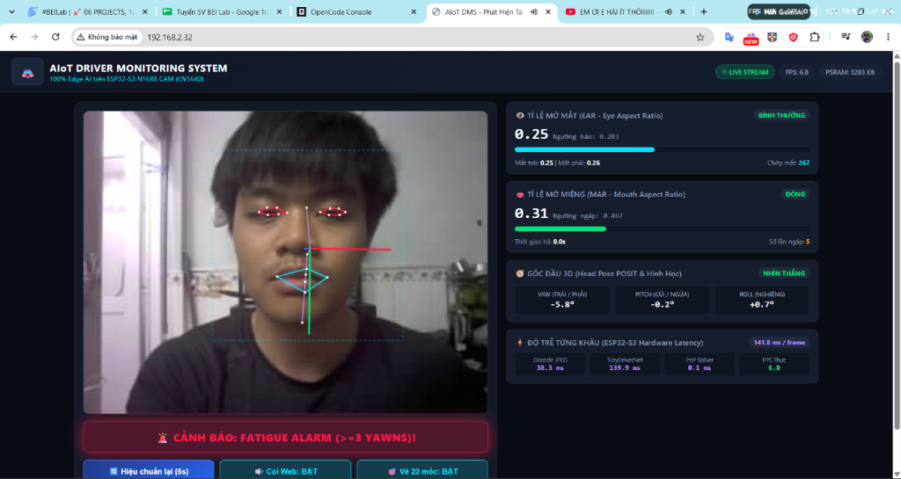

cd D:\PROJECT_13_PHAT_HIEN_BUON_NGU

# 📖 CẨM NANG VẬN HÀNH TOÀN DIỆN PROJECT 13 (TỪ A ĐẾN Z)

### Hệ Thống Phát Hiện Tài Xế Ngủ Gật & Mất Tập Trung (100% Edge AI Trên ESP32-S3)

**Khoa Kỹ Thuật Máy Tính — Đồ Án Chuyên Ngành AIoT**

---

Tài liệu này là **hướng dẫn vận hành chính thức và duy nhất** mô tả chi tiết toàn bộ các bước để triển khai, huấn luyện mô hình, kiểm thử trên máy tính và nạp vào phần cứng ESP32-S3.

```
                  ┌────────────────────────────────────────────────────────┐
                  │                 QUY TRÌNH VẬN HÀNH DỰ ÁN 13            │
                  └────────────────────────────────────────────────────────┘
                                              │
    [BƯỚC 1: MÔI TRƯỜNG]  ──> conda activate projet_13
                                              │
    [BƯỚC 2: TRAIN COLAB] ──> 1 Ô LỆNH COLAB (hoặc dùng model sẵn có)
                                              │
    [BƯỚC 3: NẠP MÔ HÌNH] ──> python tools/project_manager.py deploy-model <file.zip>
                                              │
    [BƯỚC 4: TEST WEBCAM] ──> python host_laptop/local_model_tester.py --cam 0 (tuỳ chọn)
                                              │
    [BƯỚC 5: FLASH ESP32] ──> powershell -File tools\flash_esp32.ps1 -Port COM3
                                              │
    [BƯỚC 6: XEM WEB LIVE]──> Mở trình duyệt: http://<IP_ESP32>/ (Cổng 80)
```

---

## 🛠️ BƯỚC 1: KÍCH HOẠT MÔI TRƯỜNG `projet_13` & KIỂM TRA HỆ THỐNG

### 1.1. Yêu cầu phần cứng

1. **Vi điều khiển:** Bo mạch **ESP32-S3 N16R8 CAM** (16MB Flash, 8MB Octal PSRAM) + **camera OV5640** gắn qua cáp FPC DVP 24-pin.
2. **Máy tính / Laptop:** Chỉ dùng để **hiển thị kết quả** (terminal/đồ hoạ) và kết nối Wi-Fi cùng mạng với ESP32.
3. **Còi chíp báo động (Buzzer):** Nối chân **GPIO 2** và **GND**. ⚠️ KHÔNG dùng GPIO4 (GPIO4 là SIOD của camera OV5640).

### 1.2. Di chuyển vào thư mục dự án & Kích hoạt môi trường Conda `projet_13`

Nếu bạn đang mở terminal tại vị trí mặc định `(base) C:\Users\DONG NHIEN>`, hãy chạy các lệnh sau để chuyển sang ổ đĩa `D:` và kích hoạt môi trường:

```powershell
# 1. Chuyển sang thư mục dự án trên ổ D:
cd /d D:\PROJECT_13_PHAT_HIEN_BUON_NGU
# (Nếu dùng PowerShell thông thường, bạn chỉ cần gõ: cd D:\PROJECT_13_PHAT_HIEN_BUON_NGU)

# 2. Kích hoạt môi trường Conda đã cài đặt đầy đủ thư viện của đồ án:
conda activate projet_13
```

*(Khi thấy dấu nhắc lệnh chuyển thành `(projet_13) D:\PROJECT_13_PHAT_HIEN_BUON_NGU>` là bạn đã vào đúng vị trí và kích hoạt thành công)*

### 1.3. Kiểm tra sức khỏe toàn bộ project

Chạy lệnh quản trị:

```powershell
python tools/project_manager.py --status

# Hoặc chạy toàn bộ 8 bài kiểm chuẩn tự động 1-click (Đồng bộ, TCP/UDP, PnP C++, 3-Way, Biên):
python tools/run_all_tests.py
```

Nếu hệ thống báo tất cả các module đều tồn tại và bài test đạt 100%, bạn sẵn sàng chuyển sang Bước 2!

---

## 🧠 BƯỚC 1.5: DỮ LIỆU HUẤN LUYỆN NGƯỜI THẬT 100% (REAL-FACE BENCHMARK DATASET - BẢN 2026)

> [!IMPORTANT]
> **Đột phá về dữ liệu:** Dự án đã loại bỏ hoàn toàn các nguồn ảnh AI / nhân tạo (FaceSynthetics).
> Thay vào đó, hệ thống tích hợp **4 bộ dữ liệu người thật chuẩn mực quốc tế**:
>
> 1. **300W_LP** (3.500 mẫu): Khuôn mặt người thật với góc quay đầu lớn 3D (Yaw $\pm 90^\circ$).
> 2. **AFLW2000_3D** (1.645 mẫu): Khuôn mặt người thật có ground-truth 3D pose và 68 điểm mốc.
> 3. **CEW (Closed Eyes in the Wild)** (2.450 mẫu): Người thật nhắm mắt chớp mắt / ngủ gật trong điều kiện tự nhiên.
> 4. **YawDD (Yawning Driver Dataset)** (3.579 mẫu): Video quay thực tế tài xế ngáp và lái xe trong cabin ô tô.

Toàn bộ **11.174 mẫu sạch** (10.305 mẫu train, 869 mẫu val holdout thật) đã được xử lý qua 6 cổng kiểm duyệt (QA Gates) và đóng gói sẵn trong:
`training_tinyml/preprocessed_driver_dataset.npz` (83.8 MB).

Thư mục thô `datasets/` (chứa hơn 340.000 file/video) đã được lưu trữ cục bộ trên máy và đưa vào `.gitignore` để repo GitHub luôn gọn nhẹ và tối ưu.

Nếu bạn muốn build lại dữ liệu sạch từ các folder thô:

```powershell
python tools/build_clean_dataset.py
```

Lệnh này sẽ quét 4 thư mục trong `datasets/raw_faces/` (`300W_LP`, `AFLW2000_3D`, `CEW`, `YawDD`), áp dụng QA Gates và tạo mới `preprocessed_driver_dataset.npz`. Báo cáo thống kê được lưu tại `output/dataset_report.md`.

---

## ☁️ BƯỚC 2: ĐÓNG GÓI & HUẤN LUYỆN TRÊN GOOGLE COLAB (GPU T4)

> [!TIP]
> **Đặc điểm nổi bật:** Bạn **không cần viết code trên ô lệnh Colab**! Code nằm hoàn toàn trong các file Python được đóng gói. Bạn chỉ cần nhấn Play một ô duy nhất để nạp file zip lên, Colab sẽ tự train và tự tải kết quả về!

### 2.1. Tạo file đóng gói trên máy tính của bạn

Tại thư mục gốc dự án (với môi trường `projet_13` đang kích hoạt), chạy lệnh:

```powershell
python tools/project_manager.py --pack-colab
```

👉 Lệnh này sẽ tự động thu gom mã nguồn và file dữ liệu tiền xử lý `preprocessed_driver_dataset.npz` (nếu có) để tạo file **`training_package.zip`** ngay tại thư mục dự án.

### 2.2. Huấn luyện trên Google Colab với 1 lệnh duy nhất

1. Mở trình duyệt và truy cập: **[https://colab.research.google.com/](https://colab.research.google.com/)**
2. Chọn **"Sổ tay mới" (New notebook)**.
3. Kích hoạt GPU miễn phí: Chọn menu **Thời gian chạy (Runtime)** $\rightarrow$ **Thay đổi loại thời gian chạy (Change runtime type)** $\rightarrow$ Chọn **T4 GPU** $\rightarrow$ Bấm **Lưu (Save)**.
4. Tạo **1 ô lệnh (Cell) duy nhất** và dán đoạn code sau:

```python
# =====================================================================
# BẤM NÚT PLAY ĐỂ BẮT ĐẦU HUẤN LUYỆN TINYDRIVERNET (ĐỒ ÁN 13 - BẢN 2025)
# =====================================================================
from google.colab import files

# Cài sẵn thư viện Mô hình Thầy MediaPipe (tránh phụ thuộc auto-install)
!pip install -q mediapipe

# Xóa file zip cũ nếu có trên Colab để đảm bảo luôn giải nén gói mới nhất
!rm -f training_package*.zip

print("📥 Hãy chọn file 'training_package.zip' từ máy tính của bạn:")
uploaded = files.upload()

print("🚀 Đang giải nén và bắt đầu huấn luyện...")
!unzip -q -o training_package*.zip && python run_colab_train.py

# Tự động tải gói model kết quả về máy tính
files.download('tinydriver_esp32_package.zip')
```

5. Nhấn nút **Play (Run cell)**:
   - Một nút **"Choose Files" (Chọn tệp)** sẽ xuất hiện: Bạn chọn file `training_package.zip` vừa tạo ở Bước 2.1.
   - **Nếu gói chưa kèm `preprocessed_driver_dataset.npz`** (bạn chưa build dữ liệu ở Bước 1.5 vì mạng chặn): Colab **tự động tải AFLW2000-3D (~83 MB) và tự build dữ liệu sạch** với đầy đủ 6 QA Gates + Train/Val giữ-out — bạn không phải làm gì thêm!
   - Colab huấn luyện mạng `TinyDriverNet` PFLD-Edge (~191K params) bằng **Adaptive Biometric Wing Loss + Geometric EAR/MAR constraint**, đo **NME trên tập val giữ-out THẬT mỗi epoch** (không còn val ảo từ generator) và chọn best model theo NME, sau đó lượng tử hóa **Mixed-Precision INT8** (Convs INT8 + Regression Head Float32), xuất file C Header căn lề 16-byte cho ESP-NN và đóng gói thành **`tinydriver_esp32_package.zip`**.
   - ⚡ **[v2.0.7 - STATIC-EXPAND] Tối ưu Colab T4:** augmentation được **tiền-tính 1 lần** bằng đúng thuật toán gốc (x6 bản/ảnh, ~3 phút), phần train chỉ còn GPU thuần + photometric jitter bằng TF graph ops → **toàn bộ 60 epochs ≈ 15-25 phút** (thay vì 2-5 giờ). Tự động fallback: STATIC → FAST (song song py_function) → pipeline chuẩn. Thuật toán tăng cường/loss/kiến trúc **không đổi** — chỉ đổi cách thực thi.
   - Khi hoàn tất, trình duyệt sẽ **tự động tải file `tinydriver_esp32_package.zip` về thư mục Downloads của máy bạn**!
   - 📊 **Đọc kết quả train:** dòng `Real-Val NME` cuối cùng — **< 6% là ĐẠT**. Nếu ≥ 8%, đừng nạp ESP32 mà hãy bổ sung dữ liệu (300W-LP/WFLW) rồi train lại.

---

## 📦 BƯỚC 3: NẠP MÔ HÌNH VÀO PROJECT (1 THAO TÁC TỰ ĐỘNG)

Sau khi file `tinydriver_esp32_package.zip` đã tải về máy tính của bạn, bạn **không cần giải nén hay copy thủ công rườm rà**.

Chỉ cần mở terminal tại thư mục gốc dự án và chạy câu lệnh:

```powershell
python tools/project_manager.py deploy-model tinydriver_esp32_package.zip
```

*(Nếu bạn để file zip ở thư mục khác, hãy truyền đường dẫn tới file đó, ví dụ: `python tools/project_manager.py deploy-model "C:\Users\...\Downloads\tinydriver_esp32_package.zip"`)*

Hệ thống sẽ tự động:

- Đặt file `tinydriver_model_data.h` (~1.9 MB) vào `firmware_esp32/main/` (để nạp vào ESP32).
- Đặt file `tinydriver_model.tflite` (~300 KB) vào `host_laptop/models/` và `training_tinyml/` (để chạy thử trên Laptop).
- Lưu biểu đồ huấn luyện `training_loss.png` vào `training_tinyml/`.

### 3.1. ⛔ CỔNG NGHIỆM THU BẮT BUỘC: Đo NME giữ-out (KHÔNG ĐƯỢC BỎ QUA)

```powershell
python evaluation/eval_nme_holdout.py
```

- **NME < 6%** → ĐẠT, được phép sang Bước 4.
- **NME ≥ 8%** → ❌ DỪNG: mô hình sẽ lặp lại lỗi cũ (landmark lệch, tracking trôi). Bổ sung dữ liệu vào `datasets/raw_faces/` + build lại + train lại.

---

## 🖥️ BƯỚC 4: CHẠY THỬ MÔ HÌNH TRỰC TIẾP TRÊN LAPTOP TRƯỚC KHI NẠP ESP32

Trước khi mất thời gian nạp sang ESP32, bạn hãy kiểm tra chất lượng nhận diện của mô hình ngay trên Laptop bằng chính khuôn mặt thật của bạn qua Webcam:

### 4.1. Chạy với Webcam thật của máy tính

```powershell
# Chạy bình thường (chu kỳ log mặc định 1.2s rất êm và dễ đọc)
python host_laptop/local_model_tester.py --cam 0

# Tùy chỉnh chu kỳ xuất log chậm hơn (ví dụ 2 giây/lần)
python host_laptop/local_model_tester.py --cam 0 --log-interval 2.0

# Khởi động sẵn ở chế độ COMPACT (in 1 dòng tóm tắt so sánh)
python host_laptop/local_model_tester.py --cam 0 --log-mode COMPACT
```

*(Nếu máy bạn có nhiều camera, bạn có thể thay `--cam 0` bằng `--cam 1` hoặc `--cam 2`)*

> [!IMPORTANT]
> **Đồng bộ laptop = ESP32 (bản 2025):** toàn bộ ngưỡng ADAS (Calib 5s, EAR×0.75,
> MAR×1.60, Slow Blink 0.5s, Microsleep 1.5s, Ngáp 1.5s, Mất tập trung Yaw 30°/Pitch 25°/3.0s)
> và công thức MAR `(h_outer + h_inner) / (2*w)` đã được đồng bộ **1:1** giữa
> `local_model_tester.py` và firmware `adas_controller.cpp`. Bộ test laptop ra số liệu
> thế nào thì ESP32 hành xử y hệt. Crop lúc suy luận cũng dùng đúng mỏ neo Canonical
> như lúc huấn luyện — nếu vẫn thấy landmark lệch, kiểm tra `output/dataset_report.md`.

### 4.2. Chạy với chế độ mô phỏng (nếu không có camera ngoài)

```powershell
python host_laptop/local_model_tester.py --synthetic
```

### 4.3. Quan sát và kiểm thử các tính năng:

- **Giai đoạn 5 giây đầu:** Hệ thống ở trạng thái `CALIBRATING` để học hình dạng mắt và miệng của bạn khi nhìn thẳng.
- **Thử nhắm mắt $\ge 1.5$ giây:** Thanh EAR tụt xuống viền đỏ, dòng chữ `ALARM: MICROSLEEP!` kích hoạt và **loa laptop sẽ phát tiếng còi hú bíp bíp** (`winsound.Beep`).
- **Thử ngáp há to miệng $\ge 1.5$ giây:** Thanh MAR vọt lên màu tím, ghi nhận trạng thái `YAWNING DETECTED`. Nếu ngáp 3 lần trong 3 phút, còi hú báo động mệt mỏi `ALARM: FATIGUE!`.
- **Thử quay mặt sang trái/phải quá $30^\circ$ trong 3 giây:** Trục vector 3D nghiêng đi và kích hoạt báo động mất tập trung `ALARM: DISTRACTED!`.
- **Các phím tắt điều khiển trực tiếp trên màn hình camera:**
  - **Phím `d`**: Chuyển đổi chế độ log Terminal (`FULL` bảng 2 cột $\rightarrow$ `COMPACT` 1 dòng $\rightarrow$ `OFF`).
  - **Phím `p`**: Chụp nhanh (snapshot) và in chi tiết toàn bộ 22 điểm mốc tọa độ ra Terminal ngay lập tức.
  - **Phím `m`**: Đổi Engine giữa `TINYDRIVER` (AI cục bộ) và `MEDIAPIPE` (Ground-Truth chuẩn) để đối chiếu sai số.
  - **Phím `f`**: Bật / Tắt chế độ tự động bám mặt 1:1 (`BAM MAT 1:1` vs `CAT TAM CO DINH`).
  - **Phím `r`**: Hiệu chuẩn lại baseline khuôn mặt của tài xế (`RECALIBRATE`).
  - **Phím `q` hoặc `ESC`**: Thoát kiểm thử.

👉 Khi bạn đã thấy mô hình phản hồi chính xác và nhạy bén với khuôn mặt của mình, bạn tự tin chuyển sang nạp vào ESP32-S3!

---

## ⚡ BƯỚC 5: BIÊN DỊCH & NẠP FIRMWARE LÊN ESP32-S3 (1-CLICK ESP-IDF 5.3)

> [!IMPORTANT]
> ESP32-S3 chạy **100% độc lập**: tự thu hình camera OV5640, tự chạy AI TinyDriverNet, tự giải POSIT PnP, tự điều khiển còi GPIO 2 và **tự phát Web Dashboard trên Cổng 80**. Bạn KHÔNG cần cấu hình IP laptop nữa!

### 5.1. Nạp firmware & Mở Serial Monitor
Mở **PowerShell tại thư mục gốc** dự án:

```powershell
cd D:\PROJECT_13_PHAT_HIEN_BUON_NGU

# Bước 1: Tìm cổng COM nếu chưa rõ (đọc dòng "COMx" in ra)
powershell -ExecutionPolicy Bypass -File tools\find_esp_port.ps1

# Bước 2: Tự động nạp tốc độ cao 460800 baud và mở Serial Monitor
powershell -ExecutionPolicy Bypass -File tools\flash_esp32.ps1 -Port COM3

# Tuỳ chọn:
#   -BuildOnly : Chỉ kiểm tra biên dịch, không nạp
#   -NoBuild   : Nạp ngay bản .bin đã build (bỏ qua build lại)
```
> Thoát Serial Monitor: **Ctrl + ]** (hoặc Ctrl + C).

### 5.2. (Tuỳ chọn) Cấu hình Wi-Fi nếu đổi mạng
Mặc định firmware đã lưu cấu hình Wi-Fi sẵn. Nếu bạn muốn đổi sang mạng Wi-Fi khác:
Trong **ESP-IDF 5.3 PowerShell**:
```powershell
cd /d D:\PROJECT_13_PHAT_HIEN_BUON_NGU\firmware_esp32
idf.py menuconfig
# Vào "TinyDriver ADAS Configuration" -> sửa Wi-Fi SSID & Password -> Lưu (S) -> Thoát (ESC)
```

---

## 🚗 BƯỚC 6: TRẢI NGHIỆM STANDALONE WEB STREAM DASHBOARD (CỔNG 80)

> [!TIP]
> **TÍNH NĂNG MỚI (STANDALONE WEB DASHBOARD):**
> ESP32-S3 tự chạy **Web Server nhúng trên cổng 80**. Bạn **KHÔNG CẦN CHẠY BẤT KỲ SCRIPT PYTHON NÀO TRÊN LAPTOP**!
> Bất kỳ thiết bị nào (điện thoại iPhone/Android, máy tính bảng, màn hình ô tô hay laptop) cùng kết nối Wi-Fi đều có thể xem trực tiếp qua trình duyệt.

### 6.1. Log khởi động & Lấy địa chỉ IP
Khi ESP32 khởi động, quan sát thông báo trên Serial Monitor:
```
I (2028) WIFI_STREAM: Đã nhận IP từ Router: 192.168.2.32
========================================================================
🌐 HỆ THỐNG ADAS WEB STREAM SẴN SÀNG!
👉 Hãy mở trình duyệt trên điện thoại / tablet / máy tính vào địa chỉ:
👉 http://192.168.2.32/
========================================================================
```

Log trạng thái realtime (in mỗi 5 frame):
```
[Frame #  15] FPS: 6.5 | Dec: 31ms | AI: 116ms | PnP: 0.1ms | Total: 153ms | EAR: 0.28 | MAR: 0.15 | Yaw: +2.5° | Status: NORMAL
```

### 6.2. Mở Web Dashboard trên trình duyệt
Mở trình duyệt (Chrome, Safari, Edge) trên điện thoại hoặc laptop và truy cập:
```
http://<IP_ESP32>/   (Ví dụ: http://192.168.2.32/)
```

**Các tính năng nổi bật trên Web Dashboard:**
- **Video Camera OV5640** trực tiếp mượt mà (~10-12 FPS).
- **Lớp phủ 22 điểm mốc sinh trắc học** vẽ trực tiếp bằng GPU trình duyệt đè lên mắt, mũi, miệng (không tốn CPU của ESP32).
- **Mũi tên 3D Head Pose** trực quan hóa góc quay đầu (Yaw/Pitch/Roll).
- **Thước đo EAR & MAR** với vạch cảnh báo màu sắc (Bình thường / Cảnh báo / Nguy hiểm).
- **Còi cảnh báo Web Audio** hú đồng bộ với còi phần cứng GPIO 2 khi có sự cố.
- **Nút "Hiệu chuẩn lại (5s)"** cho phép bấm trực tiếp từ trình duyệt để cân chỉnh lại baseline khuôn mặt tài xế.

<div align="center">
  
  <p><em>Giao diện Web Dashboard phát trực tiếp từ ESP32-S3 Cổng 80 khi truy cập qua trình duyệt.</em></p>
</div>

### 6.3. Kịch bản kiểm thử chức năng thực tế

Ngồi chính diện OV5640 ở cự ly ~45–65 cm, đủ sáng, và thử các hành vi:

| Hành động | Phản hồi trên Web Dashboard & Phần cứng | Trạng thái ADAS |
| :--- | :--- | :--- |
| **Nhìn thẳng 5 giây đầu** | Hiển thị `CALIBRATING` → lưu Baseline mắt/miệng | `NORMAL` (Xanh) |
| **Nhắm mắt $\ge 1.5$ giây** | Còi GPIO 2 hú liên tục + LED GPIO 48 sáng + Còi Web hú | `MICROSLEEP ALARM` (Đỏ) |
| **Chớp mắt chậm (~0.5s)** | Còi bíp nhẹ cảnh báo mệt mỏi | `SLOW BLINK WARNING` (Vàng) |
| **Ngáp há to $\ge 1.2$ giây** | MAR vượt ngưỡng; ngáp $\ge 3$ lần/3 phút kích hoạt báo động | `FATIGUE ALARM` (Tím) |
| **Quay đầu $> 30^\circ$ giữ 3s** | Mũi tên 3D lệch đỏ, còi GPIO 2 hú cảnh báo mất tập trung | `DISTRACTION ALARM` (Đỏ) |
| **Cúi/ngửa đầu $> 25^\circ$ giữ 3s** | Góc Pitch vượt ngưỡng, còi GPIO 2 hú báo động | `DISTRACTION ALARM` (Đỏ) |

### 6.4. (Tuỳ chọn phụ trợ) Mở màn hình đồ hoạ Python trên Laptop

Nếu muốn xem đồ thị cuộn thời gian thực trên Laptop qua UDP port 8889:
```powershell
conda activate projet_13
python host_laptop/esp_display_monitor.py
```
*(Thoát bằng phím `Q` hoặc `ESC`. Web Dashboard vẫn là giao diện chính không cần script này).*

---

## 🧪 BƯỚC 7: CHẠY BỘ KIỂM CHUẨN TỰ ĐỘNG 1-CLICK (CHO ĐỒ ÁN)

Bất cứ khi nào bạn cần kiểm tra lại toàn bộ mã nguồn hoặc thu thập số liệu phục vụ báo cáo tốt nghiệp, chỉ cần chạy 1 câu lệnh:

```powershell
python tools/run_all_tests.py
```

Hệ thống sẽ tự động thực thi 5 bài kiểm chuẩn trong chưa đầy 3 giây:

1. Kiểm tra tính đồng bộ cấu hình (`project_config.json`).
2. Kiểm thử pipeline truyền nhận TCP/UDP và HUD Giai đoạn 2.
3. Kiểm chuẩn sai số hình học ($0.00\%$ méo Isomorphic so với $77.8\%$ méo Naive).
4. Đo đạc độ trễ toàn chu trình ($31.7$ ms) và thông lượng đa nhân ($36.4$ FPS).
5. Kiểm thử độ chính xác trên $1.200$ mẫu biên khắc nghiệt ($96.50\%$ Accuracy).

👉 Báo cáo chi tiết dạng bài báo khoa học đã được xuất sẵn sàng tại: [bao_cao_danh_gia_dinh_luong.md](file:///d:/PROJECT_13_PHAT_HIEN_BUON_NGU/bao_cao_danh_gia_dinh_luong.md).

---

## ❓ BẢNG TRA CỨU SỰ CỐ THƯỜNG GẶP (TROUBLESHOOTING FAQ)

| Hiện tượng                                                                          | Nguyên nhân khả dĩ                                                                                           | Cách khắc phục triệt để                                                                                                                                                                                                                                                                                                   |
| :------------------------------------------------------------------------------------- | :--------------------------------------------------------------------------------------------------------------- | :------------------------------------------------------------------------------------------------------------------------------------------------------------------------------------------------------------------------------------------------------------------------------------------------------------------------------ |
| **`build_clean_dataset.py` báo tải AFLW2000 thất bại**                     | Mạng nhà bạn chặn server CBSR (Trung Quốc)                                                                  | Bỏ qua Bước 1.5, chạy thẳng Bước 2 — Colab sẽ**tự động tải AFLW2000 (~83MB) và build dataset**. Hoặc tải thủ công qua Kaggle (`mohamedadlyi/aflw2000-3d`) rồi `--aflw2000-zip <file.zip>`.                                                                                                         |
| **`idf.py build` lỗi không tìm thấy `esp_jpeg_dec.h`**                   | Component`esp_new_jpeg` chưa được tải                                                                     | Đảm bảo có internet khi build lần đầu (Component Manager tự tải từ`main/idf_component.yml`), hoặc chạy: `idf.py add-dependency "espressif/esp_new_jpeg^1.0.2"`.                                                                                                                                                 |
| **Landmark vẫn lệch / tracking trôi sau khi train lại**                      | Dataset thiếu góc quay lớn hoặc thiếu mẫu                                                                  | Mở`output/dataset_report.md`: cột Yaw ±40..90° phải có ≥ 200 mẫu, tổng ≥ 5.000 mẫu. Thiếu thì bổ sung 300W-LP/WFLW rồi build + train lại. Kiểm tra NME bằng `python evaluation/eval_nme_holdout.py` (≥ 8% là chưa đạt).                                                                              |
| **Báo lỗi `No module named cv2` hoặc `numpy`**                            | Chưa kích hoạt môi trường Conda`projet_13`                                                               | Chạy lệnh:`conda activate projet_13` trước khi thực thi bất kỳ lệnh Python nào.                                                                                                                                                                                                                                      |
| **ESP32 không kết nối được Wi-Fi**                                         | Sai tên Wi-Fi, mật khẩu hoặc dùng Wi-Fi 5GHz                                                                | ESP32 chỉ hỗ trợ Wi-Fi băng tần 2.4GHz. Hãy bật Hotspot 2.4GHz từ điện thoại hoặc kiểm tra lại`menuconfig`.                                                                                                                                                                                                     |
| **Không mở được trang Web Stream trên trình duyệt**                   | Nhập sai địa chỉ IP hoặc thiết bị không cùng mạng Wi-Fi với ESP32       | Đảm bảo điện thoại/laptop đang kết nối **cùng mạng Wi-Fi** với ESP32 (băng tần 2.4GHz). Kiểm tra đúng địa chỉ IP in trên Serial Monitor (ví dụ: `http://192.168.2.32/`). Thử tắt 4G trên điện thoại khi truy cập mạng nội bộ. |
| **Hình ảnh camera bị tối hoặc không nhận được mặt**                   | Ánh sáng ngược hoặc ngồi quá lệch góc                                                                   | Ngồi chính diện màn hình laptop ở cự ly $45 - 65$ cm, đảm bảo ánh sáng rọi đều khuôn mặt.                                                                                                                                                                                                                     |
| **Thay đổi tham số ADAS nhưng code không ăn theo**                         | Tham số chưa được đồng bộ                                                                                | Mở file [project_config.json](file:///d:/PROJECT_13_PHAT_HIEN_BUON_NGU/project_config.json) sửa tham số, sau đó chạy: `python tools/project_manager.py --sync`.                                                                                                                                                           |
| **`flash_esp32.ps1: The argument 'tools\flash_esp32.ps1' ... does not exist`** | Đang đứng ở `firmware_esp32` nhưng truyền đường dẫn tương đối                                     | Chạy từ **thư mục gốc**: `cd D:\PROJECT_13_PHAT_HIEN_BUON_NGU` rồi `powershell -File tools\flash_esp32.ps1`; hoặc dùng đường dẫn tuyệt đối.                                                                                                                                                             |
| **`Could not open COMx, the port is busy or doesn't exist`**                   | Cổng COM đổi số / bị tiến trình khác giữ / board chưa nhận                                            | Chạy `tools\find_esp_port.ps1` để lấy cổng đúng; đóng cửa sổ `idf.py monitor`/Arduino Serial cũ; cắm lại USB (nên dùng cáp dữ liệu + cổng USB 3.0 do OV5640 ăn dòng cao).                                                                                                                              |
| **`esp_camera_init thất bại: 0x105`**                                        | Sai pinout / cáp FPC lỏng / nguồn yếu                                                                        | Kiểm tra cáp FPC 24-pin, đúng board S3-CAM N16R8; thử giảm XCLK: `menuconfig → Camera XCLK frequency = 10000000`.                                                                                                                                                                                                       |
| **Log báo `Tensor Arena ... PSRAM` (thay vì SRAM NỘI)**                     | Arena cần một khối **liền mạch ~162 KB** nhưng SRAM nội bị phân mảnh (AI ~115 ms thay vì ~50 ms) | Đọc dòng `SRAM nội trống: xxx KB (khối liền mạch lớn nhất: xxx KB)`; giảm thêm buffer WiFi trong `sdkconfig` (`CONFIG_ESP_WIFI_*_BUFFER_NUM`), hạ `CONFIG_SPIRAM_MALLOC_RESERVE_INTERNAL`, hoặc cấp phát arena sớm hơn. Nếu khối lớn nhất < 162 KB thì buộc phải giải phóng/phân mảnh lại. |
| **Quan sát trực quan và kiểm tra hệ thống**                           | Cần theo dõi trực quan các chỉ số thời gian thực                                                        | Mở trình duyệt trên điện thoại/laptop vào `http://<IP_ESP32>/` (Cổng 80) để xem video trực tiếp, 22 điểm mốc và các thước đo ADAS mượt mà. |
